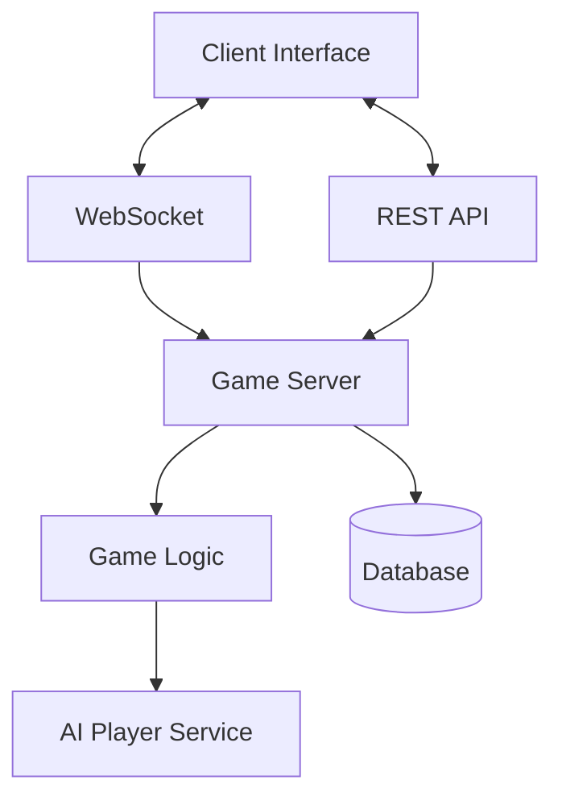

# Football Guess Who - Master Implementation Document

## Project Overview

"Football Guess Who" is a real-time multiplayer quiz game based on the classic "Guess Who" concept, where players deduce each other's secret footballer by asking yes/no questions about player attributes. The game features both single-player mode against AI and multiplayer mode for playing against other users.

## Core Game Concept

- **Multiplayer Mode:** Two players compete in real-time
- **Single Player Mode:** Play against AI opponent (easy/medium/hard difficulty)
- **Game Board:** 24 footballer cards with distinct visual characteristics
- **Question System:** Yes/no questions about footballer attributes
- **Educational Features:** Player information cards for learning

## Technical Architecture

### Tech Stack Requirements

#### Frontend
- React 18+ with TypeScript
- Vite as build tool
- Tailwind CSS for styling
- React Query for data fetching
- React Router for navigation
- Jest and React Testing Library for testing

#### Backend
- Node.js (v18+) with Express
- TypeScript
- PostgreSQL database
- Prisma as ORM
- Socket.io for real-time multiplayer functionality
- Jest for testing

#### DevOps
- Docker and Docker Compose for containerization
- GitHub Actions for CI/CD

### System Architecture Overview

The system employs a client-server architecture with real-time communication:



### Modular Architecture Requirements

#### Frontend Architecture
- Feature-based folder structure
- Separate UI components from business logic
- Reusable UI component library
- Custom hooks for shared functionality
- State management with React Context API
- Unit tested game logic

#### Backend Architecture
- Controller-service-repository pattern
- Separate modules for:
  - Player data management
  - Game state management
  - User authentication
  - WebSocket communication
- Middleware for logging and error handling

#### Database Design
- Normalized schema for footballer data
- Separate tables for game sessions, users, and game history
- Database migrations for schema changes

### Containerization Requirements

#### Docker Setup
- Separate containers for:
  - Frontend application
  - Backend API
  - PostgreSQL database
- Volume mounting for persistent data
- Hot-reloading for development

#### Docker Compose Configuration
- All services defined in a single docker-compose.yml
- Environment variables for configuration
- Proper networking between containers
- Health checks for each service

## Core Data Models

```typescript
// Core entities
interface Footballer {
  id: string;
  name: string;
  image: string;
  club: string;
  nation: string;
  position: "GK" | "DEF" | "MID" | "FWD";
  ageBracket: string;
  hairColor: string;
  facialHair: string;
  bootsColor: string;
  // Other traits as needed
}

interface PlayerSession {
  sessionId: string;
  socketId: string;
  displayName: string;
  isHuman: boolean;
  secretId: string; // FK to Footballer
  eliminatedIds: string[];
  remainingQuestions: number;
  isTurn: boolean;
  lastActive: Date;
  wantsRematch: boolean;
  askedQuestions: string[]; // Array of question IDs
}

interface GameRoom {
  roomId: string;
  mode: "SP" | "MP";
  players: PlayerSession[];
  state: "waiting" | "in-progress" | "finished";
  subState?: "waitingForAnswer" | "pendingRematch";
  turnHistory: TurnRecord[];
  startedAt: Date;
  winnerId?: string;
  settings: {
    turnTimeLimit: number | null;
    maxQuestions: number;
    difficulty: 'easy' | 'medium' | 'hard';
  };
}

interface Question {
  id: string;
  text: string;
  trait: keyof Footballer;
  expectedValues: string[];
}

interface GameStatistic {
  id: string;
  gameRoomId: string;
  totalTurns: number;
  questionCount: number;
  duration: number;
  winnerId: string;
  createdAt: Date;
}
```

## Game Process Flows

### 1. Game Initialization Flow

1. Player creates a game (single or multiplayer mode)
2. For single-player mode:
   - AI player is automatically initialized
   - Secret footballers are assigned to both players
   - First player is randomly selected
3. For multiplayer mode:
   - Wait for second player to join
   - When second player joins, secret footballers are assigned
   - First player is randomly selected
4. Game state transitions to "in-progress"

### 2. Turn Process Flow

1. Active player can:
   - Ask a question from the catalogue
   - Make a final guess
2. For questions:
   - Question is validated by server
   - Opponent answers yes/no
   - Server processes answer and updates eliminated cards
   - Turn switches to other player
3. For guesses:
   - Server validates the guess against the opponent's secret
   - If correct: Player wins
   - If incorrect: Player loses

### 3. AI Decision Process (Single Player Mode)

1. AI checks remaining footballer IDs
2. Decision logic:
   - If only 1 card remains: Make guess
   - If only 2 cards remain: Consider guess or question
   - If more than 2 cards remain: Find best question
3. AI uses information entropy optimization to select questions
4. Difficulty levels modify AI decision quality:
   - Easy: Makes random mistakes ~40% of the time
   - Medium: Makes mistakes ~20% of the time
   - Hard: Always makes optimal decisions

### 4. Card Elimination Process

1. When an answer is received:
   - Get question trait and expected values
   - If answer is "Yes": Eliminate cards where trait ≠ expected values
   - If answer is "No": Eliminate cards where trait = expected values
2. Update eliminated IDs array
3. Broadcast updates to all players

### 5. Game End & Rematch Flow

1. When game ends:
   - Record game statistics
   - Set game state to "finished"
   - Broadcast result to players
2. Players can:
   - Request rematch: Wait for opponent's decision
   - Leave room: Clean up resources
3. If both players want rematch:
   - Reset game state
   - Start new game

## Implementation Optimizations

### Data Architecture Improvements

1. **Enhanced PlayerSession Entity**
   - Session persistence with `lastActive` timestamp
   - Rematch state tracking with `wantsRematch` flag
   - Question tracking with `askedQuestions` array

2. **GameRoom Improvements**
   - Room settings for configuration options
   - SubState field for granular state management

3. **Database Transaction Safety**
   - Database transactions for game state updates
   - Optimistic concurrency control

### Game Logic Refinements

1. **AI Difficulty Levels**
   - Easy: Makes random decisions occasionally
   - Medium: Uses optimal algorithm but makes mistakes
   - Hard: Always uses optimal algorithm

2. **Question Evaluation Optimization**
   - Pre-compute question results for faster card elimination
   - Lookup tables for question-to-footballer matching

### Scalability Enhancements

1. **Event-Driven Architecture**
   - Redis Pub/Sub for communication between instances
   - Separation of game session persistence from game logic

2. **Caching Strategy**
   - Redis-based caching for frequently accessed data
   - TTL for automated cleanup of stale sessions

## Implementation Timeline and Team Workflow

1. **Phase 1: Architecture & Planning** (Days 1-2)
   - Create detailed component diagrams
   - Define data models and API contracts
   - Design database schema with entity relationship diagrams

2. **Phase 2: Core Implementation** (Days 3-7)
   - Data models and database setup
   - Core game logic (without UI)
   - Basic UI components
   - API endpoints
   - State management

3. **Phase 3: Integration & Polish** (Days 8-10)
   - Connect all components
   - Implement real-time functionality
   - Add animations and polish
   - Conduct end-to-end testing

## Debugging & Testing Infrastructure

### Frontend Debugging Tools
- React DevTools integration
- State management debugging (Redux/React Query DevTools)
- Error tracking (react-error-boundary, Sentry)
- Performance monitoring (why-did-you-render)

### Backend Debugging Tools
- Comprehensive logging (winston, morgan)
- API documentation and testing (Swagger/OpenAPI)
- Database debugging tools (Prisma Studio)

### Game-Specific Debug Tools
- Custom debug panel (Ctrl+Shift+D)
- Game state visualizer
- Network simulation tools
- Real-time debug overlay

## Testing Strategy

1. **Unit Testing**
   - Core game logic components
   - API endpoints
   - Database operations

2. **Integration Testing**
   - Game flow processes
   - Socket communication
   - State transitions

3. **End-to-End Testing**
   - Complete game sessions
   - Edge cases (disconnections, timeouts)
   - Performance under load

4. **Automated Game Simulation**
   - Simulate concurrent games for load testing
   - Test server performance
   - Identify bottlenecks

## Important Implementation Considerations

1. **Server-Side Authority**: Maintain all game state server-side to prevent cheating
2. **Sequence Numbers**: Use turn sequence numbers to prevent race conditions
3. **Transaction Safety**: Process turn updates atomically
4. **Reconnection Handling**: Store session IDs for reconnection
5. **Error Recovery**: Define clear error states and recovery paths
6. **Data Validation**: Validate all client inputs before processing
7. **Rate Limiting**: Implement rate limiting to prevent abuse
8. **Event Logging**: Log all game events for debugging and analytics 